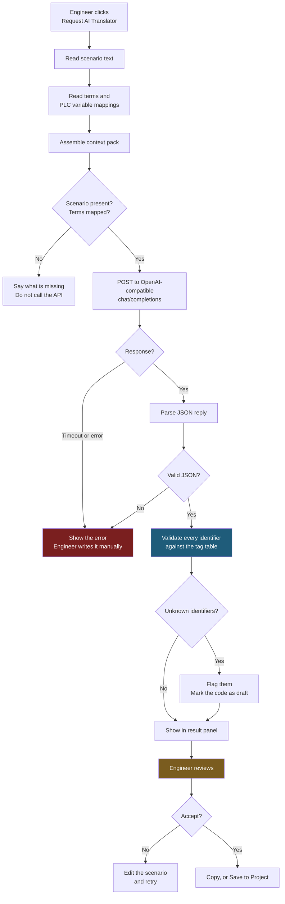
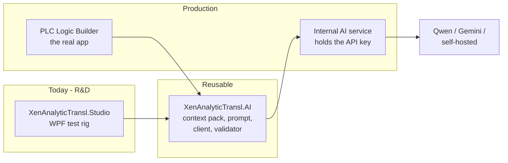
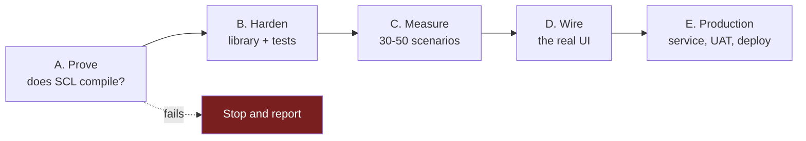

# Execution plan - Gen AI Integration

Flowcharts and the full to-do list. Setup instructions are in `00-START-HERE.md`.
Task numbers refer to planner rows 21-32.

---

## The one open question

> **Can plant scenario text and PLC tag names be sent to an external AI service?**

Ask whoever owns your IP or source-control policy. It decides the provider and therefore
the architecture. Everything in Phase A below can proceed with **invented** scenarios while
it is unanswered - which is why Phase A is first.

| Answer | Provider | Consequence |
|---|---|---|
| Data may leave | Qwen via Alibaba Cloud, Gemini, Azure AI Foundry | Low effort, best quality |
| Data may not leave | Self-hosted Qwen3.8-27B on your own GPU server | Hardware, ongoing ops, weaker output |

Because the code is written against the OpenAI-compatible protocol, either answer costs
you a Base URL and a model name - not a rewrite.

---

## How a translation runs

The two highlighted steps are what keep this safe. **Identifier validation** catches
invented variable names - the failure mode that still compiles and still looks right.
**Engineer review** is the gate before anything reaches equipment.

---

## Where the code lives

The Studio is disposable. `XenAnalyticTransl.AI` is what survives into the product.

---

## To-do list

### Phase A - Prove it works (tasks 21, 23, 24)

- [ ] Ask the policy owner the open question above
- [ ] Create the Alibaba Cloud account
- [ ] Create the API key in the **Singapore** region
- [ ] `setx DASHSCOPE_API_KEY "..."`, then reopen the terminal
- [ ] Put your Workspace ID into the Base URL in the Studio
- [ ] Run the Studio, confirm the toolbar shows `Key: OK`
- [ ] Translate the sample Mtr01 scenario
- [ ] **Paste the SCL into TIA Portal. Does it compile?**
- [ ] Read the logic as an engineer. Is it right, or just plausible?
- [ ] Iterate `PromptBuilder.SystemPrompt` until output is consistently usable
- [ ] Add two or three few-shot examples from your own verified SCL
- [ ] Try `qwen3.7-max`, and one non-Qwen model, on the same scenario

**Gate:** if carefully-prompted SCL never compiles, stop and report that. Better to know in
week one than month four.

### Phase B - Harden the library (task 25)

- [ ] Write the remaining three Mtr01 scenarios (System Handle, S1, S2)
- [ ] Add a Vlv01 scenario - a second equipment type shakes out assumptions
- [ ] Unit-test `TagValidator` with a deliberately hallucinated variable
- [ ] Unit-test `PromptBuilder` output shape
- [ ] Add recorded-response tests so the suite needs no network and costs nothing
- [ ] Handle the rate-limit case (HTTP 429) with a retry and backoff

### Phase C - Measure (task 27)

- [ ] Save 30-50 runs to `Reference/runs/` via **Save Run...**
- [ ] For each: does it compile, is the logic correct, is it consistent across repeats
- [ ] Record latency and token counts per model
- [ ] Work out cost per 1,000 translations for each candidate
- [ ] Pick the model on this evidence, not on a benchmark table
- [ ] Write the result into the decision log in `docs/master-plan.md`

### Phase D - Wire the real UI (task 26)

- [ ] Reference `XenAnalyticTransl.AI` from the real PLC Logic Builder project
- [ ] Build the context pack from the live panels instead of the Studio's sample
- [ ] Add the Request AI Translator button with progress and cancel
- [ ] Result panel: Generated Logic, Explanation, Validation
- [ ] Error and fallback states - never fail silently
- [ ] Wire **Save to Project** behind an explicit confirmation

### Phase E - Production (tasks 28-32)

- [ ] Stand up the internal AI service that holds the key
- [ ] Move the client from calling the provider directly to calling that service
- [ ] Environment configuration for dev / test / prod
- [ ] Azure DevOps build and release pipeline
- [ ] Monitoring: usage, error rate, cost alerts
- [ ] Server-side load and failure testing
- [ ] UAT with 3-5 PLC engineers
- [ ] User guide, ops runbook, prompt rationale

---

## Order of work

Phase A is the whole project in miniature and needs no permission, no budget and no
hardware. Do it before anything else.

---

## Folder map

| Folder | Holds |
|---|---|
| `src/XenAnalyticTransl.AI/` | The reusable library |
| `src/XenAnalyticTransl.Studio/` | The R&D test rig |
| `Reference/` | This plan, the start guide, saved runs |
| `Reference/runs/` | Saved translation runs - your evaluation set |
| `docs/` | Master plan, Gemini flowchart, job scope |
| `Project/` | The original console scaffold |
