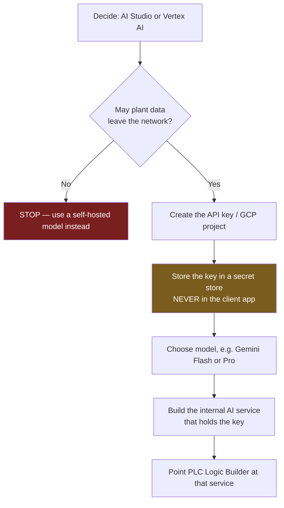
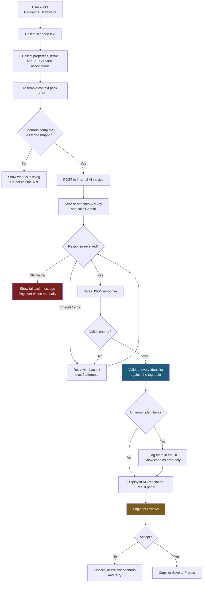
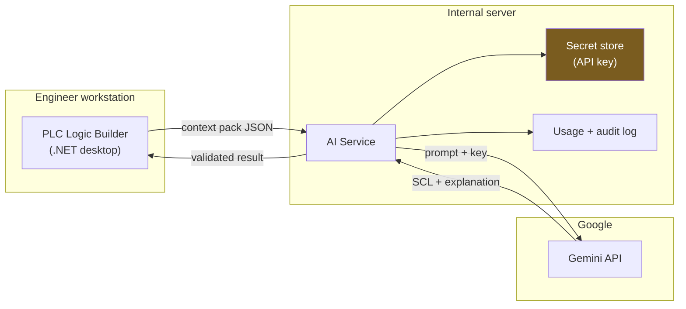

# Gemini Integration Flow

How **PLC Logic Builder** calls Google Gemini to translate a natural-language
scenario into SCL (Structured Text).

---

## 0. Before any code: choose the access route

Gemini is reachable two ways, and the choice is **not** interchangeable.
It affects data handling, billing and enterprise controls.

| | Google AI Studio | Vertex AI (Google Cloud) |
|---|---|---|
| Get a key in | ~2 minutes | Requires a GCP project |
| Best for | Prototyping, the PoC | Production, enterprise |
| Data residency control | Limited | Yes, region-pinned |
| VPC / private networking | No | Yes |
| Audit logging | Minimal | Full Cloud Audit Logs |
| Billing | Per API key | GCP billing account |

**Recommendation:** AI Studio for the proof of concept (task 24), Vertex AI for
anything that ships. Your scenarios contain equipment names, control logic and
tag structures — plant intellectual property. Vertex AI gives the data-residency
and audit controls that a customer or auditor will eventually ask about.

> **Blocking decision:** confirm whether scenario and property data may leave the
> network at all. If it may not, Gemini is off the table entirely and the project
> moves to a self-hosted model. Settle this before writing integration code.

---

## 1. One-time setup



**Why the key never sits in the desktop app:** PLC Logic Builder is distributed
to every engineer's machine. A key compiled into the binary can be extracted in
minutes, and it bills to your account until someone notices.

---

## 2. Runtime flow — what happens on a button click



The two highlighted steps are the ones that keep this safe:
**identifier validation** catches hallucinated variable names, and
**engineer review** is the gate before anything reaches real equipment.

---

## 3. Where each component lives



---

## 4. Request and response shape

**Sent to the service** — the context pack:

```json
{
  "equipment": "Mtr01",
  "target_language": "SCL",
  "scenario": "When in Auto Mode, Manual Operation position will change...",
  "terms": [
    { "name": "PLC Initializing", "variable": "Sys_plsInit", "value": 1 }
  ],
  "timers": ["RunFailAlarmTimer", "TripAlarmTimer"]
}
```

**Returned to the UI** — structured so the Explanation tab and the validator
both have something to work with:

```json
{
  "code": "IF AutoMode THEN ...",
  "explanation": "Lines 2-6 map the Auto Mode condition...",
  "variables_used": ["AutoMode", "ManualOperation", "Sys_plsInit"],
  "warnings": ["Scenario does not state behaviour when both conditions are true"]
}
```

The `warnings` array surfaces ambiguity in the scenario instead of letting the
model silently guess.

---

## 5. Setup checklist

| # | Step | Owner | Done |
|---|---|---|---|
| 1 | Confirm plant data may leave the network | Policy owner | ☐ |
| 2 | Create AI Studio key for the PoC | Developer | ☐ |
| 3 | Store key outside source control | Developer | ☐ |
| 4 | Hand-build a context pack for the Mtr01 scenario | Developer | ☐ |
| 5 | Iterate the prompt until output compiles in TIA Portal | Developer | ☐ |
| 6 | Wrap as a class library with schema + identifier validation | Developer | ☐ |
| 7 | Stand up the internal AI service | Developer | ☐ |
| 8 | Wire the Request AI Translator button | Developer | ☐ |
| 9 | Build the 30–50 scenario evaluation set | Developer | ☐ |
| 10 | Migrate to Vertex AI before production | Developer | ☐ |

---

## 6. Notes

- **Model choice:** start with a fast, cheap Gemini model. Only move to a larger
  one if the evaluation set shows the smaller one failing. Cost per call matters
  once every engineer uses this daily.
- **Never commit the key.** `.gitignore` already excludes `.env`,
  `secrets.json` and `appsettings.Local.json`. This repo mirrors to GitHub, so a
  leaked key would need scrubbing from two remotes.
- **Deterministic first.** If the app already translates some scenarios by rule,
  keep that path and use Gemini only where it falls short. Rules that work are
  cheaper and more predictable than any model.
